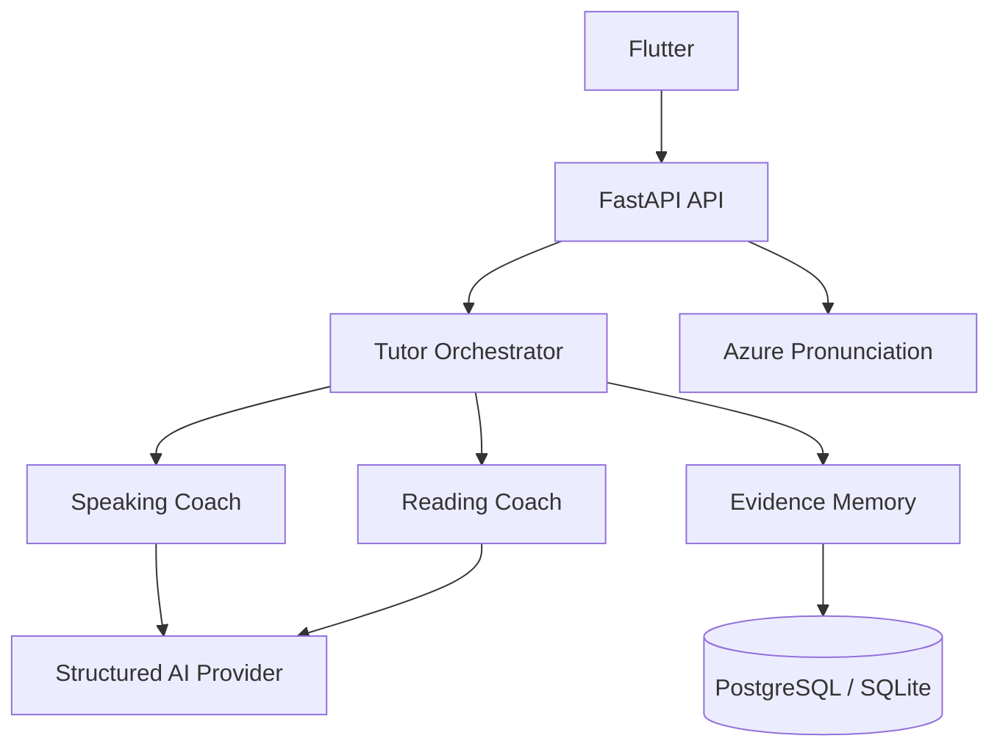

# تنفيذ معلم Hiwar الذكي — Speaking وReading

هذا الفرع يضيف النسخة الأولى من معلم إنجليزي متكيّف، مع فصل واضح بين منطق التطبيق الحتمي وقرارات الذكاء الاصطناعي. الهدف هو بناء أساس قابل للقياس والتطوير، لا روبوت محادثة يعتمد على Prompt واحد.

## ما تم تنفيذه

- `TutorOrchestrator` واحد داخل FastAPI ينسّق الجلسات والذاكرة والتخصصات.
- `SpeakingCoach` لمحادثة قصيرة مناسبة للمستوى والهدف، بحد أقصى ملاحظتين مهمتين لكل دور.
- إعادة الجملة المصححة ومقارنة المحاولة الجديدة بالنص المستهدف، بحد أقصى ثلاث محاولات.
- `ReadingCoach` ينشئ نصًا متكيّفًا ويقيس: الفكرة الرئيسية، التفاصيل، الاستنتاج، والمفردات من السياق.
- كلمات مستهدفة تعرض المعنى العربي وIPA ومثالًا، مع نطق TTS عند الضغط.
- انتقال من ملخص Reading إلى مناقشة موضوع النص في Speaking.
- ذاكرة تعلم مبنية على أدلة، مع مراجعة متباعدة وخطة يومية.
- شاشة تقدّم لا تعرض نسبة عند غياب الأدلة الكافية.
- تسجيل استخدام النموذج والتوكنات والمدة في `ai_usage_events` عند استخدام مزود AI.
- مخرجات AI منظّمة ومتحقق منها بعقود Pydantic صارمة، مع بديل حتمي عند غياب المفتاح أو فشل المزود.
- خدمة مزوّد نص مركزية يستخدمها Chat وAssessment والـAgents جميعًا؛ تختار Gemini مؤقتًا أو OpenAI لاحقًا من دون اتصالات مباشرة مكررة داخل المسارات.
- تقييم نطق حقيقي من ملف صوتي قصير عبر Azure Speech؛ لا تُعرض درجة إذا لم يصل دليل صوتي صالح.

## طريقة العمل



الـOrchestrator هو صاحب القرار النهائي في الحفظ، وعدد التصحيحات، وملكية الجلسة، وحالة التقدم. النموذج لا يكتب مباشرة في قاعدة البيانات.

## قواعد Speaking

- المحادثة الحالية تعمل كسلسلة: تعرف صوت الجهاز `STT` ← تحليل المعلم ← نطق الرد `TTS`.
- لا يُستنتج أو يُعرض تقييم نطق من Transcript؛ قيمة `pronunciation` تبقى `null` دون دليل صوتي حقيقي.
- مسار `/pronunciation/assess` يقبل WAV PCM أحادي القناة 16-bit/16kHz أو OGG Opus، ولمدة لا تتجاوز 30 ثانية.
- يحفظ Backend الدرجات والكلمات الضعيفة فقط؛ بايتات الصوت لا تُحفظ، و`audio_retained` دائمًا `false`.
- إذا كان الكلام المتعرّف عليه لا يطابق النص المرجعي بما يكفي، تُعاد النتيجة بتحذير ولا تُضاف إلى ذاكرة التعلّم.
- أي خطأ يقترحه النموذج يُرفض برمجيًا إذا لم تكن عبارته موجودة في كلام المستخدم الحالي.
- تظهر ملاحظة أو ملاحظتان فقط، ثم يطلب المعلم إعادة الجملة عند وجود خطأ مهم.
- بعد ثلاث محاولات غير ناجحة ينتقل المعلم للمحادثة ويجدول النقطة للمراجعة بدل إرهاق المستخدم.
- يتم إرسال آخر أربعة أدوار فقط وبحدود نصية للمزود لتقليل التكلفة وحماية السياق.

## قواعد Reading

- الدرس يحتوي أربع مهارات إلزامية: `main_idea` و`detail` و`inference` و`vocabulary`.
- الإجابة الصحيحة يجب أن تكون مدعومة بالنص، وعقود البيانات تمنع مجموعة أسئلة ناقصة أو متكررة.
- يمكن لاحقًا تمرير نص يختاره المستخدم عبر `source_text`؛ يعامل كنص غير موثوق وليس كتعليمات للنموذج.
- النسخة الحالية تقيس فهم المقروء. OCR والقراءة بصوت عالٍ وتقييم الاكتمال والإيقاع والنطق مراحل لاحقة لأنها تحتاج ملفات المنصات ومسار صوت حقيقي.

## ذاكرة التعلم والتقدّم

يُسجّل كل دليل أولًا في `learning_events`. لا ينتقل إلى `learning_items` إلا إذا تحقق واحد من الآتي:

- ثقة لا تقل افتراضيًا عن `0.86`.
- تكرر الدليل مرتين على الأقل.
- كان الدليل حتميًا مستقلًا مثل إجابة Reading أو فشل إعادة الجملة.

كل عنصر تعلم يحتفظ بـ`skill_code`، ونسبة الإتقان، والثقة، وعدد الأدلة، والحالة، وآخر ظهور، وموعد المراجعة. الجلسة الفارغة لا تحتسب جلسة مكتملة ولا تصنع تقدّمًا وهميًا.

## واجهات API الجديدة

جميع الواجهات التالية تتطلب JWT Bearer وتستنتج المستخدم من التوكن؛ لا تقبل `user_id` من جسم الطلب.

| Method | Endpoint | الغرض |
|---|---|---|
| POST | `/api/v1/speaking/sessions` | بدء جلسة Speaking مخصصة |
| POST | `/api/v1/speaking/sessions/{session_id}/turns` | تحليل دور واحد والرد عليه |
| POST | `/api/v1/speaking/turns/{turn_id}/retry` | تقييم محاولة الإعادة |
| POST | `/api/v1/speaking/sessions/{session_id}/finish` | إنهاء الجلسة وحفظ الملخص |
| POST | `/api/v1/reading/sessions` | إنشاء جلسة ونص Reading |
| POST | `/api/v1/reading/sessions/{session_id}/answers` | تقييم إجابة فهم واحدة |
| POST | `/api/v1/reading/sessions/{session_id}/finish` | إنهاء الدرس وحفظ الملخص |
| GET | `/api/v1/learning-plan/today` | النشاط الأنسب اليوم |
| GET | `/api/v1/progress` | تقدّم مبني على الأدلة |
| POST | `/api/v1/pronunciation/assess` | تقييم نطق صوتي موثوق وربطه اختياريًا بجلسة Speaking أو Reading |

## جداول البيانات الجديدة

- `tutor_sessions`
- `speaking_turns`
- `speaking_attempts`
- `reading_materials`
- `reading_attempts`
- `learning_events`
- `learning_items`
- `ai_usage_events`
- `agent_traces`

SQLite مناسب للاختبارات والتطوير المحلي. PostgreSQL هو مصدر الحقيقة المطلوب للإنتاج، ويمكن إضافة Redis لاحقًا للحالة المؤقتة وRate Limiting فقط.

## إعداد البيئة

القيم التي يجب ضبطها في Secrets الخاصة ببيئة الـBackend (من دون تعديل أو رفع ملفات `.env`):

- `AI_TEXT_PROVIDER=auto` أو `gemini`
- `GEMINI_API_KEY`
- `GEMINI_MODEL=gemini-2.5-flash`
- `OPENAI_API_KEY` (اختياري لاحقًا)
- `AI_TUTOR_MODEL`
- `AI_TUTOR_MAX_TOKENS`
- `AI_TUTOR_TIMEOUT_SECONDS`
- `PRONUNCIATION_PROVIDER=azure`
- `AZURE_SPEECH_KEY`
- `AZURE_SPEECH_REGION`
- `AZURE_SPEECH_ENDPOINT` (اختياري)
- `AZURE_PRONUNCIATION_ENABLE_PROSODY=False`
- `PRONUNCIATION_MAX_AUDIO_BYTES=2097152`
- `MEMORY_MIN_CONFIDENCE`
- `MEMORY_REPEAT_THRESHOLD`
- `AUDIO_RETENTION_ENABLED=False`
- `REDIS_URL`

في الإعداد المؤقت احفظ `GEMINI_API_KEY` و`AZURE_SPEECH_KEY` و`AZURE_SPEECH_REGION` و`SECRET_KEY` في Secrets الخاصة ببيئة التشغيل، وليس في Flutter أو GitHub. يجب أن تبقى القيم فارغة داخل `.env.example`، ولا تحفظ النسخة الحالية ملفات الصوت في Backend.

لاختبار الإعداد المؤقت، أضف القيم التالية في أسرار Emergent ثم أعد تشغيل Backend:

```dotenv
AI_TEXT_PROVIDER=gemini
GEMINI_API_KEY=<secret>
PRONUNCIATION_PROVIDER=azure
AZURE_SPEECH_KEY=<secret>
AZURE_SPEECH_REGION=<azure-region>
```

إذا لم تُضف المفاتيح، يبقى Speaking وReading عاملين بالبديل الحتمي، وتعيد واجهة تقييم النطق `503` بدل اختلاق درجة. استخدم Gemini المجاني أثناء التطوير ببيانات اختبارية فقط؛ سياسة معالجة بيانات الخطة المجانية قد تختلف عن الخطط المدفوعة.

## التشغيل والتحقق المحلي

من مجلد `Backend`:

```bash
python -m venv .venv
.venv/bin/pip install -r requirements.txt
.venv/bin/python -m pytest -q
.venv/bin/uvicorn app.main:app --reload
```

اختبارات الـAgents والمزوّدات والنطق تمرر حاليًا 30 اختبارًا. المجموعة الكاملة تمرر 71 اختبارًا وتبقي 18 اختبار Chat قديمًا فاشلًا؛ وهي نفس حالات الفشل الموجودة على `origin/main` لأنها تستدعي دالة Chat مباشرة من دون تمرير مستخدم JWT مصادق عليه. لم تتم إضافة استثناء يتجاوز الحماية لإرضاء تلك الاختبارات. أعد تشغيل المجموعة بعد تحديث اختبارات Chat لتستخدم dependency override أو مستخدمًا مصادقًا عليه.

## المطلوب من المبرمج عند الدمج

1. مراجعة الـPR المبني فوق آخر `origin/main` وعدم دمجه قبل نجاح فحوصات CI.
2. إنشاء Migration رسمية للجداول التسعة عبر Alembic في نسخة الإنتاج بدل الاعتماد على `create_all`.
3. استكمال ملفات Flutter المفقودة `android/` و`ios/` وإضافة أذونات الميكروفون والتعرف على الصوت، ثم تشغيل `flutter analyze` و`flutter build web` واختبارات الجهاز؛ بيئة التنفيذ الحالية لا تحتوي Flutter SDK.
4. إبقاء JWT و`FlutterSecureStorage` الحاليين؛ يستخدم `SharedPreferences` فقط لمعرّف المستخدم وتفضيلات الصوت وليس للتوكن.
5. اختبار PostgreSQL وCI وبيئة Staging قبل أي دمج إلى `main` أو نشر.
6. إبقاء حفظ الصوت معطلًا والتأكد من تحويل تسجيل الهاتف إلى WAV PCM 16kHz mono أو OGG Opus قبل استدعاء واجهة التقييم.
7. ضبط Rate Limit خاص بواجهة النطق بما يتناسب مع حد Azure المجاني، واختبار سلوك `429` في Staging.

## التطوير التالي المقترح

- Realtime/WebRTC لصوت طبيعي منخفض التأخير مع مفتاح مؤقت يصدره Backend.
- توسيع اختبارات مزود النطق للهجات والضوضاء وأجهزة Android وiOS المختلفة.
- OCR لإدخال النصوص المصورة، ثم مقارنة الكلمات المحذوفة والمضافة عند القراءة بصوت عالٍ.
- Evals دورية تقيس دقة التصحيح، عدم اختلاق الأخطاء، مناسبة CEFR، تحسن إعادة المحاولة، والتكلفة لكل جلسة.

الانتقال لهذه المراحل يجب أن يبقى تدريجيًا ومقاسًا، مع عدم إرسال الذاكرة كاملة أو تحليل كل كلمة بصوت مستقل في كل دور.

مراجع التصميم الرسمية: [OpenAI Structured Outputs](https://developers.openai.com/api/docs/guides/structured-outputs) و[OpenAI Voice agents](https://developers.openai.com/api/docs/guides/voice-agents).
