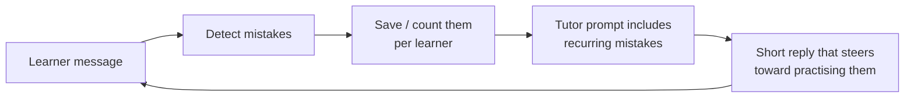

# Bulbul (بلبل)

> Formerly **Hiwar** (حوار). The repository keeps its original name, `Hiwar-App`.

An AI English-conversation tutor for Arabic-speaking learners. You talk to the tutor by voice or text. It replies briefly, corrects your real mistakes, **remembers them**, and steers later conversations so you practise exactly what you got wrong.

Built with **Flutter** (Arabic RTL UI) and a **FastAPI** backend, with Gemini as the main AI provider.

---

## The learning loop

Most chat tutors forget a mistake as soon as they correct it. Bulbul keeps it and brings it back:



1. **Detect.** Every message goes through two independent checks:
   - a deterministic rule-based checker (e.g. over-regularised past tenses like *goed → went*, *I am go → I am going*);
   - the AI model, which returns structured JSON corrections.
2. **Save.** Mistakes are stored per learner. If the same mistake comes back, its counter goes up instead of creating a duplicate ("goed" and "I goed" count as one). Repeats are matched in code with whole-word matching, so the counter doesn't depend on the model noticing, and a correct sentence like *"I am going"* never counts as the saved mistake *"I am go"*. AI corrections are only saved if the quoted text actually appears in the learner's message, which guards against hallucinated errors.
3. **Practise.** The learner's top unmastered mistakes are added to the tutor's system prompt. The tutor works them into the conversation and briefly praises the learner when they use the correct form.

The tutor's replies are capped at 1–3 short sentences and always end with a follow-up question. This is enforced in the prompt and again in code (`_limit_reply`).

## Reliability

- **Provider fallback.** If Gemini fails (quota, outage, timeout) and an OpenAI-compatible key is configured, the request goes to OpenAI automatically. Text-to-speech falls back from ElevenLabs to Gemini TTS to on-device TTS.
- **Honest failure states.** If no provider is reachable, the app says the analysis didn't run, and never claims "no mistakes". Provider errors are mapped to clear user-facing messages; keys and stack traces are never exposed.
- **Malformed model output.** If the model returns broken JSON, only the `reply` field is recovered; raw JSON is never shown to the learner.
- **Prompt-injection guard.** Learner text is kept out of the system instruction, and the tutor is told never to change its rules because a message asks it to.

## Features

- Voice and text conversation with an adaptive tutor (speech-to-text in, natural TTS out, choice of tutor voice)
- "Slow down" and "simplify" controls during voice chat
- Mistakes page with repeat counts and manual mastery
- Level assessment (grammar, vocabulary, reading, listening, speaking) saved as a CEFR level, with level history
- Daily journal with AI corrections and a follow-up question
- Progress comparison, streaks, daily reminders, shareable achievement card
- Email sign-up with verification codes, Google and Apple sign-in, permanent account deletion

## Tech stack

| Layer | Technology |
|---|---|
| Mobile / web app | Flutter (Dart), Arabic RTL UI, `dio`, `speech_to_text`, `flutter_tts`, `flutter_secure_storage` |
| Backend | FastAPI, SQLAlchemy, Alembic, Pydantic |
| Database | SQLite by default; PostgreSQL supported via `DATABASE_URL` |
| AI | Google Gemini (primary), OpenAI-compatible API (fallback) |
| Voice | ElevenLabs / Gemini TTS, on-device TTS fallback |
| Auth & security | JWT, PBKDF2 password hashing, Google/Apple ID-token verification, per-user ownership checks, rate limiting |

## Testing

```bash
cd Backend
python -m pytest -q          # ~7 s
cd ../frontend
flutter test
```

- The backend tests never call real AI or email services. A shared fixture in `tests/conftest.py` clears all provider keys, and tests that need an AI reply use a fake model (`fake_gemini`). The suite is fast, works offline, and doesn't use up API quota.
- Coverage includes the learning loop (saving, repeat counting, de-duplication, whole-word matching, hallucinated corrections), malformed AI output, provider failure, auth and cross-user data isolation, and account deletion.

## Running locally

**Backend**

```bash
git clone https://github.com/janabakri/Hiwar-App.git
cd Hiwar-App/Backend
python -m venv .venv
.venv\Scripts\activate          # Windows; use `source .venv/bin/activate` on macOS/Linux
pip install -r requirements.txt
cp .env.example .env            # then add your GEMINI_API_KEY and SECRET_KEY
uvicorn app.main:app --reload
```

The API docs are then at <http://localhost:8000/docs>.

**Flutter app**

```bash
cd frontend
flutter pub get
flutter run --dart-define=API_BASE_URL=http://localhost:8000
```

By default the app uses `http://localhost:8000`, or `http://10.0.2.2:8000` on the Android emulator.

> API keys belong only in `Backend/.env`, which is git-ignored. Never put them in the Flutter app.

## Project structure

```
Backend/
  app/api/v1/        chat, assessment, journal, conversations, profile/auth, tts
  app/services/      rule-based error detection
  app/models/        users, errors, conversations, journal, level history
  tests/             pytest suite
frontend/
  lib/screens/       welcome, auth, onboarding, home, voice chat, review
  lib/services/      API client, reminders
```
